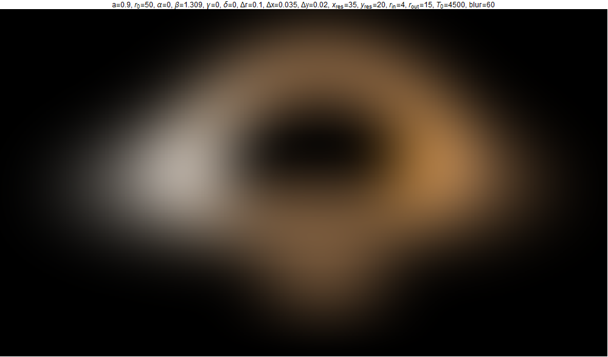
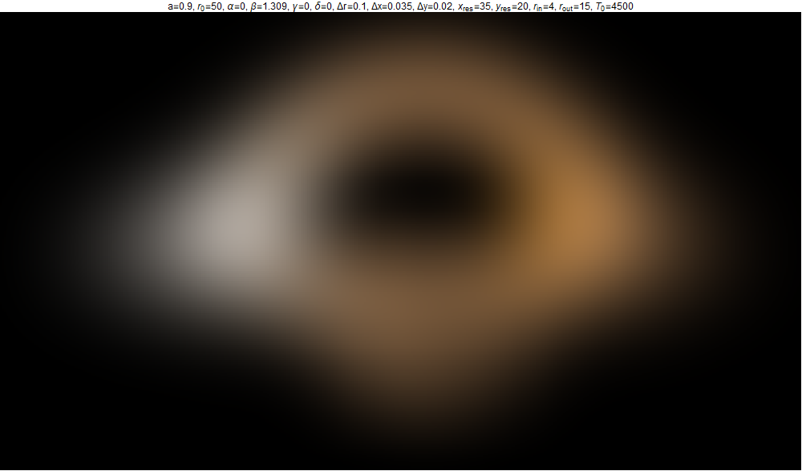
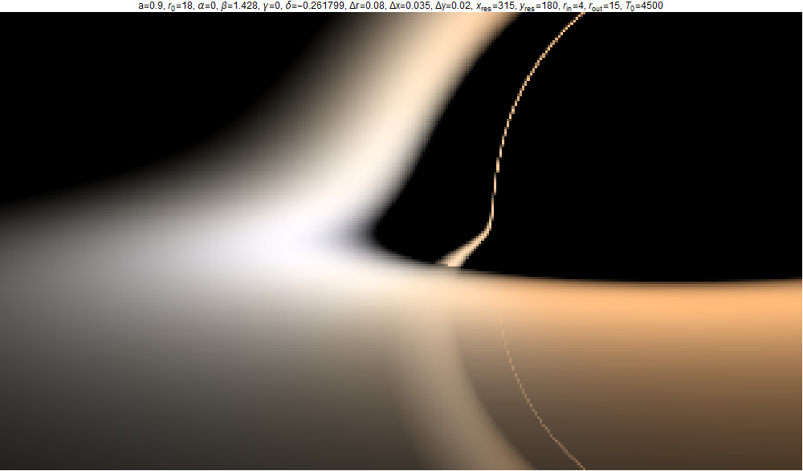

# BH-raytracing

Create images of Kerr black holes.

#### Overview:
The geodesic equation is numerically solved for null rays near a Kerr black hole. The position and orientation of the camera are chosen and for each pixel the fate of the geodesic is determined, with an equitorial annulus providing a simple model of an accretion disk.

## Sample output

Images               |  w/ Gaussian blur
:-------------------:|:-------------------:
  |  
  |  

## Computation background

### Kerr metric

The metric for a black hole with mass _M_ and angular momentum _J_ in Boyer-Lindquist coordinates (_t,r,θ,φ_) is

$$ \mathrm{d}s^2 = -\left(1-\frac{r_sr}{\Sigma}\right)\\,\mathrm{d}t^2 + \frac{\Sigma}{\Delta}\\,\mathrm{d}r^2 + \Sigma\\,\mathrm{d}\theta^2 + \left(r^2 + a^2 + \frac{r_sra^2}{\Sigma}\sin^2{\theta}\right)\sin^2{\theta}\\,\mathrm{d}\phi^2 - \frac{2r_sra\sin^2{\theta}}{\Sigma}\\,\mathrm{d}t\mathrm{d}\phi \\,, $$

where

$$ r_s = 2G_N M \\,, \qquad a = \frac{J}{M} \\,, \qquad \Sigma = r^2 + a^2\cos^2{\theta}  \\,, \qquad \Delta = r^2 - r_sr + a^2 \\,. $$

For convenience choose units where $G_NM = 1$, so that $r_s=2$ and $a\in[-1,1]$. With this choice the inner and outer horizons are located at $r_\pm = 1 \pm \sqrt{1-a^2}$.

### Conserved quantities and null geodesics

There are two "obvious" conserved quantities associated to the Killing vectors $\partial_t$ and $\partial_\phi$, which are the energy $E=-p_t$ and angular momentum $L_z=-p_\phi$. There is also a third conserved quantity, the Carter constant:

$$ Q = p_\theta^2 - \cos^2{\theta}\left(a^2E^2-L_z^2\csc^2{\theta}\right) \\,, $$

which is associated to a Killing tensor. These three constants of motion, along with $p_\mu p^\mu = 0$, are enough to determine a null geodesic uniquely. With affine parameter _λ_ (so that $\frac{\mathrm{d}x^\mu}{\mathrm{d}\lambda} = p^\mu$), trajectories are found by solving the following equations of motion,

$$ \Sigma\frac{\mathrm{d}t}{\mathrm{d}\lambda} = -a\left(aE\sin^2{\theta} - L_z\right) + \frac{r^2 + a^2}{\Delta}P(r) \\,, \quad \Sigma\frac{\mathrm{d}r}{\mathrm{d}\lambda} = \pm\sqrt{R(r)} \\,, \quad \Sigma\frac{\mathrm{d}\theta}{\mathrm{d}\lambda} = \pm\sqrt{\Theta(\theta)} \\,, \quad \Sigma\frac{\mathrm{d}\phi}{\mathrm{d}\lambda} = - \left(aE - L_z\csc^2{\theta}\right) + \frac{a}{\Delta} P(r) \\,, $$

where the potentials are

$$ P(r) = E(r^2 + a^2) - aL_z \\,, \quad R(r) = P(r)^2 - \Delta\left(Q + (aE-L_z)^2\right) \\,, \quad \Theta(\theta) = Q + \cos^2{\theta}\left(a^2E^2 - L_z^2\csc^2{\theta}\right) \\,. $$

Since the above coordinates are singular at the outer horizon, it is useful to shift to coordinates which are smooth at the outer horizon when integrating the geodesic equations:

$$ \mathrm{d}v = \mathrm{d}t + \frac{r^2 + a^2}{\Delta}\\,\mathrm{d}r \\,, \quad \mathrm{d}\varphi = \mathrm{d}\phi + \frac{a}{\Delta}\\,\mathrm{d}r \\,. $$

### Images

Images are built based on a "pinhole camera" design; an array of pixels (dimensions $\Delta x\times\Delta y$) is located a distance $\Delta r$ behind the aperature. For each pixel the values of $E,L_z,Q$ are found for the geodesic connecting that pixel to the aperature. The geodesic equation is then integrated out until the outer horizon is crossed, the light escapes to a larger radial coordinate than where it started, or an "accretion disk" located in the equitorial plane is hit.

Four angles (_α,β,γ,δ_) position the camera. The aperature is located at

$$ \mathbf{r} = R_x(\beta)\cdot R_z(\alpha)\cdot (r_0\hat{\mathbf{z}}) $$

and pixel (_i,j_) is located at

$$ \mathbf{r}_{ij} = R_x(\beta)\cdot R_z(\alpha)\cdot \left(R_y(\delta)\cdot R_z(\gamma)\cdot \langle\delta x_i,\delta y_j, \Delta r \rangle + r_0\hat{\mathbf{z}}\right) \\,. $$

Redshift is computed by comparing $\omega = -u^\mu p_\mu$ at the source to at the observer. Both are assumed to be massive so that $u_\text{s}^2 = u_\text{o}^2 = -1$. Notice that the choice of affine parameter drops out of the ratio $\frac{\omega_\text{s}}{\omega_\text{o}}$.

